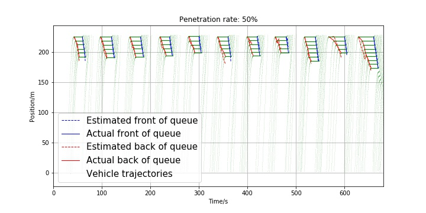

# Queue estimation

In this project, the method of Kalman filter was applied to realize the purpose to predict the queue length in a real-time level. CAV (Connected and aotonomous vehicles) data was used for measuremnet data, and basic newtonian kinemetics model was applied to do the prediction. Then, the estimated queue length was calculated by combining them two, the proportion of which were determined based on their standard deviations.

# Sample figures and results
## Estimated back of queue and front of queue, penetration rate = 50%

## Estimated queue length, penetration rate = 50%

## Estimated/actual max queue length in each cycle, penetration rate = 50%

## A sensitivity analysis of estimation error (cycle 1 - cycle 11) v.s. CAV penetration rate

